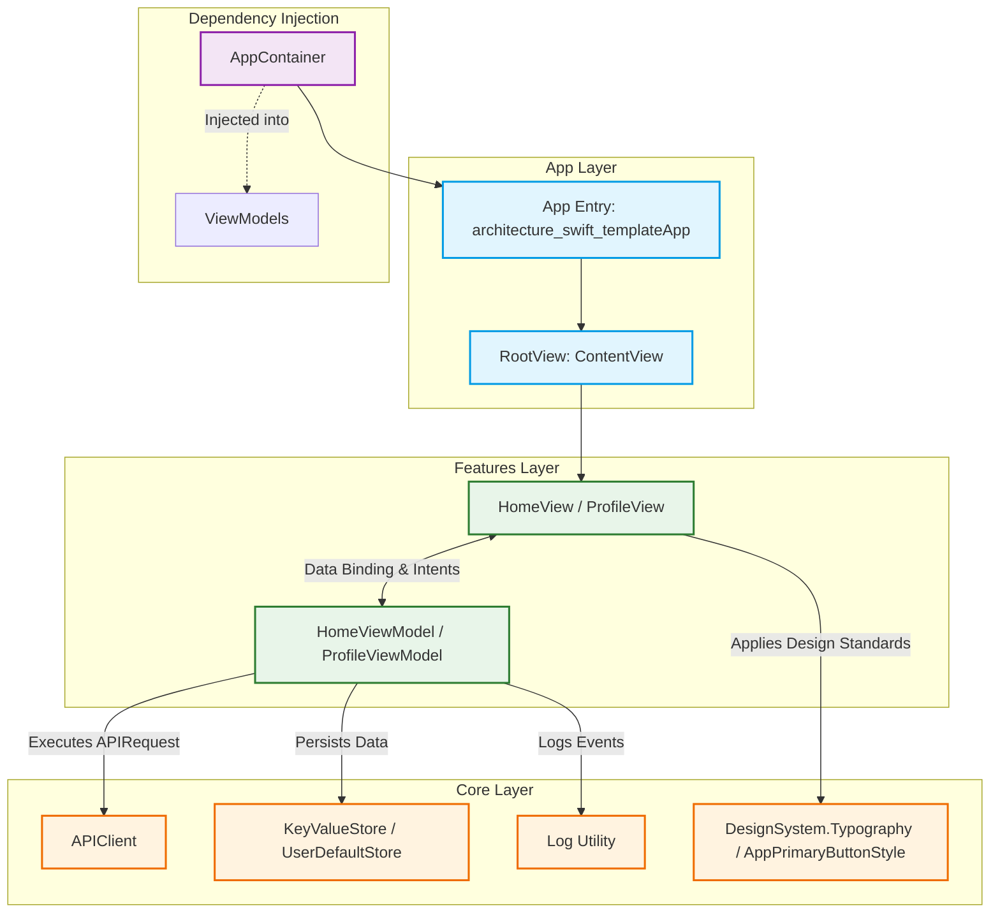

# SwiftUI Clean Architecture Template

A modern, highly-scalable, and lightweight Swift/SwiftUI architecture template designed for iOS apps. This repository implements **MVVM (Model-View-ViewModel)** with **Protocol-Oriented Programming (POP)**, modular boundaries, a central **Dependency Injection (DI) Container**, and dynamic async/await networking.

---

## 🏗️ Architecture Blueprint

This template relies on a strict separation of concerns divided into three main layers: `App`, `Core`, and `Features`.



### Folder Structure

```text
architecture-swift-template/
├── App/                            # Application Entry & Window Management
│   ├── architecture_swift_templateApp.swift   # App @main setup & container initialization
│   └── ContentView.swift           # Application Root View / Router
│
├── Core/                           # Shared Foundations & Platform Capabilities
│   ├── DI/                         # Dependency injection graph (AppContainer)
│   ├── Logging/                    # Logging utilities & interfaces
│   ├── Model/                      # Shared network payloads & universal DTOs
│   ├── Networking/                 # Network layer (APIClient, APIRequest protocol)
│   ├── Service/                    # Concrete requests/endpoints definitions
│   ├── Storage/                    # Storage interfaces (KeyValueStore, UserDefaultStore)
│   └── UI/                         # Design System (typography, button styles)
│
└── Features/                       # Highly decoupled business domains
    └── Home/                       # Domain capability (UI + state binding)
        ├── HomeView.swift          # Feature UI implementation
        └── HomeViewModel.swift     # Screen State management & user event logic
```

---

## 🧩 Core Architectural Concepts

### 1. Protocol-Oriented Networking (`APIClient`)
Rather than relying on a monolithic network manager class containing dozens of API-specific functions, networking is entirely **Protocol-Oriented**. Each HTTP request is modeled as a small, isolated `struct` conforming to the `APIRequest` protocol:

```swift
protocol APIRequest {
    associatedtype Response: Decodable
    associatedtype Body: Encodable = EmptyBody
    
    var method: HTTPMethod { get }
    var url: URL? { get }
    var query: [String: String]? { get }
    var body: Body? { get }
}
```

* **Benefits**: High modularity, zero merge conflicts on network code, and simple mocking of individual requests.
* **Execution**: The `APIClient` executes requests asynchronously using Swift's native `async/await` syntax:
  ```swift
  let response = try await container.api.execute(GetServerTimeRequest())
  ```

### 2. Constructor-Based Dependency Injection (`AppContainer`)
The `AppContainer` serves as the single source of truth for application dependencies:
```swift
final class AppContainer {
    let log: Log.Type
    let store: KeyValueStore
    let api: APIClient
    
    init(
        log: Log.Type = Log.self,
        store: KeyValueStore = UserDefaultStore(),
        api: APIClient = APIClient()
    ) { ... }
}
```
* **Dependency Flow**: Instantiated exactly once at the app entry point (`architecture_swift_templateApp`), passed down to `ContentView`, and injected into ViewModels upon instantiation.
* **Testability**: Dependencies are protocol-abstracted (e.g., `KeyValueStore`). During testing or SwiftUI Previews, you can inject mock classes or mock containers instantly.

### 3. Local Storage Abstraction (`KeyValueStore`)
Local storage is protected by the `KeyValueStore` protocol:
```swift
protocol KeyValueStore {
    func set(_ value: String, forKey key: String)
    func string(forKey key: String) -> String?
    func set(_ value: Bool, forKey key: String)
    func bool(forKey key: String) -> Bool
    func removeValue(forKey key: String)
}
```
* **Default Store**: Supported by `UserDefaultStore` which wraps `UserDefaults.standard`.
* **Mocking**: Eases the creation of an in-memory mock store for automated testing to prevent tests from writing to actual persistent memory.

### 4. SwiftUI View-ViewModel Architecture (MVVM)
* **Views**: Declarative, purely visual, and react directly to changes in state. They delegate all interactive actions to their ViewModels.
* **ViewModels**: Conformed to `@MainActor` and subclassed from `ObservableObject`. They capture view actions, execute service code, and expose state via `@Published` properties.

---

## 🛠️ Step-by-Step Developer Guide

### 1. How to Add a New Feature
Suppose you want to add a **Profile** feature:

#### Step 1: Create the Feature Folder
Create a new directory: `Features/Profile/`.

#### Step 2: Implement the ViewModel (`ProfileViewModel.swift`)
```swift
import Foundation
import Combine

@MainActor
final class ProfileViewModel: ObservableObject {
    private let container: AppContainer
    
    @Published var username: String = ""
    @Published var isLoading: Bool = false
    
    init(container: AppContainer) {
        self.container = container
        loadProfile()
    }
    
    private func loadProfile() {
        // Retrieve local value or fallback
        username = container.store.string(forKey: "profile_username") ?? "Guest User"
    }
    
    func updateUsername(_ newName: String) {
        username = newName
        container.store.set(newName, forKey: "profile_username")
        container.log.info("Username updated to \(newName)")
    }
}
```

#### Step 3: Implement the View (`ProfileView.swift`)
```swift
import SwiftUI

struct ProfileView: View {
    @StateObject var viewModel: ProfileViewModel
    @State private var inputName: String = ""
    
    var body: some View {
        VStack(spacing: 20) {
            Text("Welcome, \(viewModel.username)!")
                .typography(.title)
            
            TextField("Enter your name", text: $inputName)
                .textFieldStyle(.roundedBorder)
                .padding(.horizontal)
            
            Button("Save Username") {
                viewModel.updateUsername(inputName)
            }
            .buttonStyle(.appPrimary(isFullWidth: false))
        }
        .padding()
        .navigationTitle("Profile")
    }
}
```

#### Step 4: Hook It Up in your Navigation/Parent View
```swift
NavigationLink("Go to Profile") {
    ProfileView(viewModel: ProfileViewModel(container: container))
}
```

---

### 2. How to Define and Execute a New Network Request
To request data from an endpoint (e.g., fetch user profile from `https://api.example.com/user`):

#### Step 1: Define the Response DTO (`Core/Model/`)
```swift
struct UserProfileResponse: Decodable {
    let id: String
    let name: String
    let email: String
}
```

#### Step 2: Define the Request (`Core/Service/`)
```swift
struct GetUserProfileRequest: APIRequest {
    typealias Response = UserProfileResponse
    typealias Body = EmptyBody // No body is uploaded
    
    var method: HTTPMethod = .get
    
    var url: URL? {
        URL(string: "https://api.example.com/user")
    }
    
    var query: [String: String]? = nil
    var body: EmptyBody? = nil
}
```

#### Step 3: Execute in your ViewModel
```swift
func fetchUserData() {
    Task {
        do {
            let response = try await container.api.execute(GetUserProfileRequest())
            self.username = response.name
        } catch {
            container.log.error("Failed fetching user: \(error.localizedDescription)")
        }
    }
}
```

---

### 3. SwiftUI Previews & Mocking
To keep SwiftUI Previews robust and offline-capable without polluting production configurations, build a static mock helper:

```swift
extension AppContainer {
    static var mock: AppContainer {
        AppContainer(
            log: Log.self,
            store: MockStore(), // Implement a lightweight KeyValueStore conforming dictionary mock
            api: APIClient()
        )
    }
}

// Inside your SwiftUI View Preview:
#Preview {
    NavigationStack {
        HomeView(viewModel: HomeViewModel(container: .mock))
    }
}
```

---

## 📈 Scalability and Real-World Implementation

When transitioning this template to a complex corporate or enterprise codebase, we recommend scaling using these strategies:

1. **Local Storage Upgrades**: Replace `UserDefaults` inside the storage layer with a robust database (such as SwiftData or CoreData) or secure keychain storage by building concrete implementations conforming to a unified storage protocol contract.
2. **Swift Package Manager (SPM) Modularity**: Scale into multi-target modular architectures by splitting folders (`Core`, `Features/Home`) into separate Swift Packages. This drastically reduces incremental compilation times.
3. **Advanced Coordinator Pattern**: Introduce a router/coordinator layer if screen-to-screen navigation flows become complex, allowing the ViewModel to trigger navigation events through an abstracted delegate interface instead of embedding hardcoded navigation views inside UI code.

---

## 🧼 Code Management and Best Practices

* **View Ownership**: Views should always be dumb. They bind to ViewModels and style labels, nothing more. Avoid putting async blocks, data parsing, or persistent side-effects inside views.
* **ViewModel MainActor Binding**: Ensure all ViewModels are annotated with `@MainActor` to prevent multi-threaded state update issues on SwiftUI's main loop.
* **Consistent Design Primitives**: Rely strictly on the typography and button styles under `Core/UI/`. Avoid setting custom sizes, system fonts, or inline padding manually across view elements.
  * *Typography*: `Text("Text").typography(.title)` or `Text("Text").typography(.body)`
  * *Buttons*: `.buttonStyle(.appPrimary())`
* **Dependency Cleanliness**: Never instantiate global shared singletons directly inside features. If a class requires networking, database, or logging capabilities, it *must* receive them through dependencies declared in `AppContainer`.
